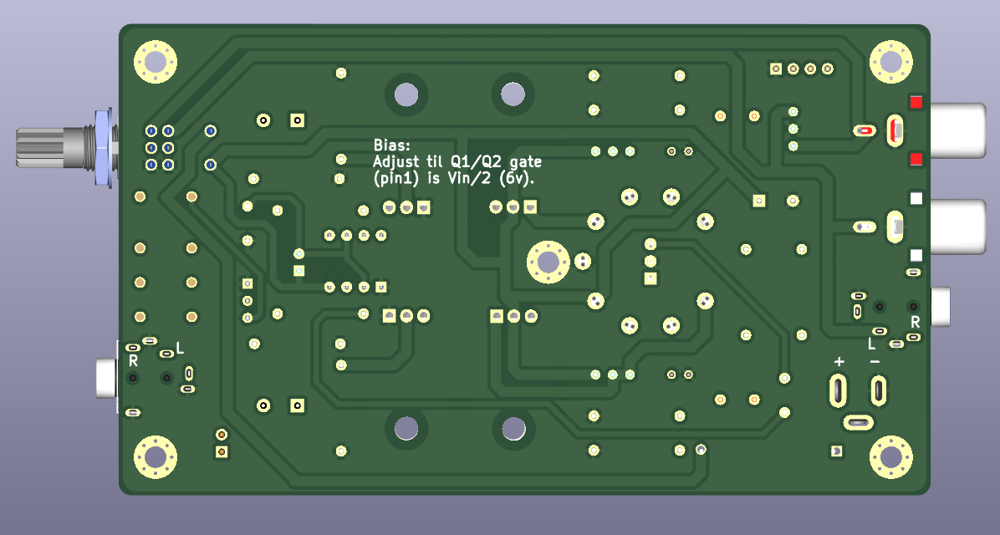
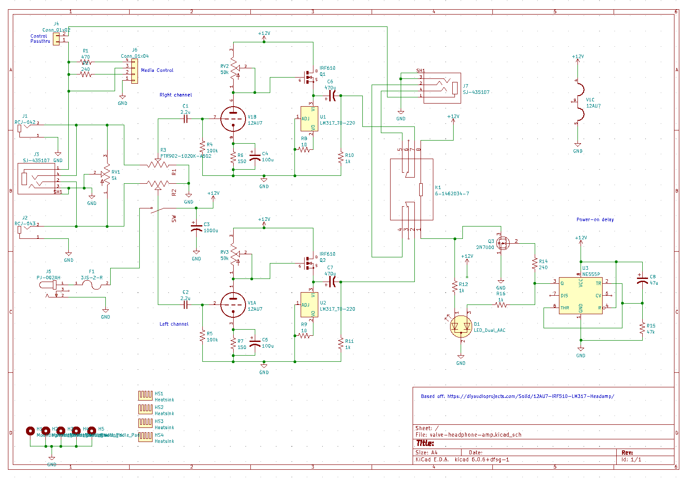

# TOOBS - valve headphone amplifier

A low voltage valve headphone amplifier, based off a simple design
from [Rogers Gomez](https://diyaudioprojects.com/Solid/12AU7-IRF510-LM317-Headamp/).

## Features/specs

- Power: 12vDC <1A
- Frequency response: 15-20kHz +- 2dB
- Input: RCA or 3.5mm stereo, mic passthrough.
- Media control support (via 3.5mm TRRS)
- Output: 3.5mm stereo
- Output protetion: ~5s power-on delay
- BoM cost: ~$45AUD (without 12AU7)

## 3d PCB view

See it [here](https://buxtronix.github.io/toobs/3d/trrs.html). It will take about 20s to load the model.

*(Code from https://github.com/easyw/vrm360)*

## General notes

See more detailed notes on the general circuit on the [original
page](https://diyaudioprojects.com/Solid/12AU7-IRF510-LM317-Headamp/).

### Media control / mic

The board has 4-pin TRRS connectors, and can support media control and mic
passthrough (not supported when using the RCA inputs).

The 'Control' connector near the right RCA jack can be used for media
control. Just connect buttons between G and +, -, P and these will have
the same functionality as inline media controls on many headphones. Don't
forget you also need a 4-pin 3.5mm patch to the input source.

Bridge J4 if your headphones have a 4-pin TRRS connector and you'd like to
bridge the mic and/or media control buttons. You'll also need a TRRS patch
lead on the input.
If your headphones are only 3-pin but you'd like to use the media controls
on the board, remove J4. If you leave J4 bridged with 3 pin headphones,
the media controls will not work.

### Valve bias

During initial testing, you will need to set the valve anode bias. With 
no source playing, adjust ' R. Bias' whilst measuring the Q1 gate voltage,
such that it's about half the supply voltage (~6v). Do the same for 'L bias'
and measuring the gate of Q2. This adjustment would generally only need to
be done once, and perhaps every few dozen hours of operation.

### Balance

The balance control is intended to adjust for any mismatch on the valve
triodes. With a mono source playing, adjust until the audio is centered.

## Photos (rendered)

Assembled board

PCB front side

PCB back side

Schematic

