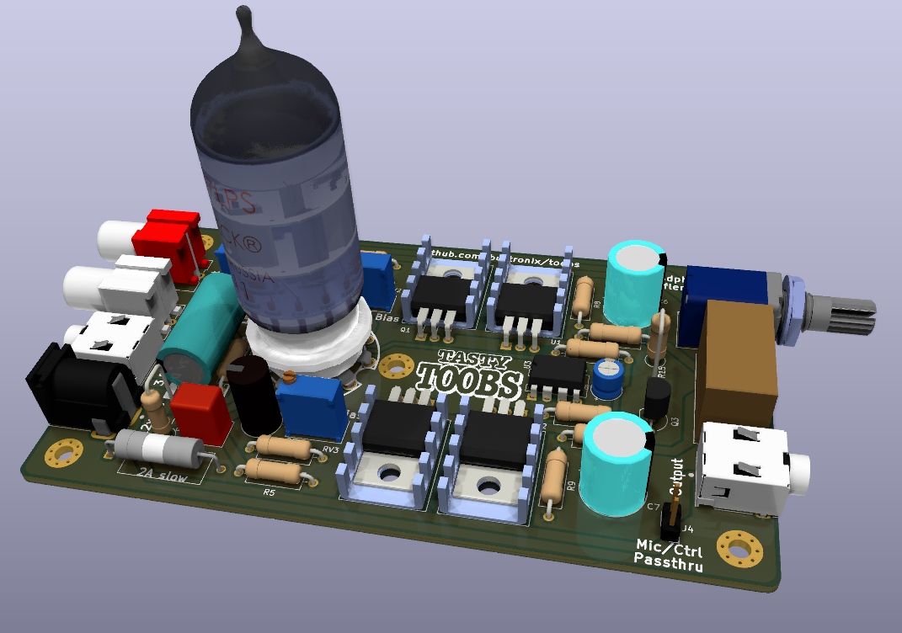
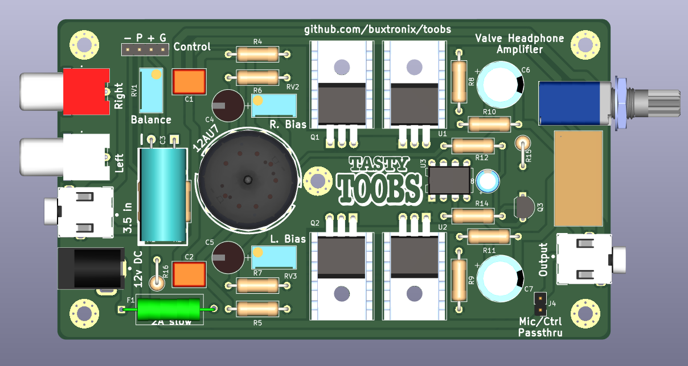

# TOOBS - valve headphone amplifier

A low voltage valve headphone amplifier, based off a simple design
from [Rogers Gomez](https://diyaudioprojects.com/Solid/12AU7-IRF510-LM317-Headamp/).

## Features/specs

- Power: 12vDC <1A
- Frequency response: 15-20kHz +- 2dB
- Input: RCA or 3.5mm stereo
- Output: 3.5mm stereo
- Output protetion: ~5s power-on delay
- BoM cost: ~$45AUD (without 12AU7)

## Photos (rendered)

Assembled board

PCB front side

PCB back side

Schematic

